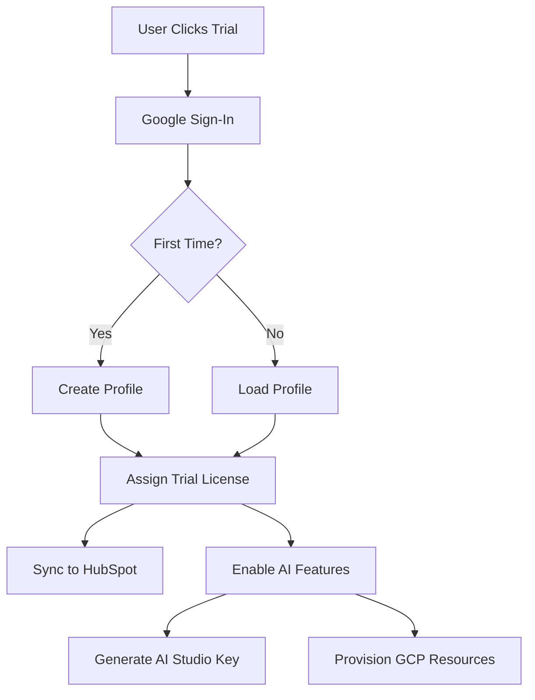

# Google Identity as Platform Foundation

## Overview
Google Sign-In isn't just for authentication - it becomes the cornerstone for:
1. **Identity & Access**: Single sign-on across all Anava services
2. **Trial License Management**: Track and assign Axis camera licenses  
3. **AI Studio Integration**: Generate API keys using Google identity
4. **GCP Infrastructure**: Provision Vertex AI resources per customer
5. **Marketing Attribution**: HubSpot lead tracking

## Architecture Flow



## 1. Google Sign-In Implementation

### A. Replace Email/Password with Google OAuth
```typescript
// src/renderer/pages/CameraSetupPage.tsx
import { GoogleAuthProvider, signInWithPopup } from 'firebase/auth';

const handleGoogleSignIn = async () => {
  try {
    setError('Signing in with Google...');
    
    const provider = new GoogleAuthProvider();
    provider.addScope('https://www.googleapis.com/auth/userinfo.email');
    provider.addScope('https://www.googleapis.com/auth/userinfo.profile');
    
    // This gives us future ability to manage their GCP resources
    // provider.addScope('https://www.googleapis.com/auth/cloud-platform');
    
    const result = await signInWithPopup(auth, provider);
    const user = result.user;
    
    // Get ID token for backend calls
    const idToken = await user.getIdToken();
    
    // Request trial license with Google identity
    const licenseResult = await window.electronAPI.license.assignKeyWithGoogle({
      idToken,
      displayName: user.displayName,
      email: user.email,
      photoURL: user.photoURL
    });
    
    if (licenseResult.success) {
      setLicenseKey(licenseResult.key);
      setUserProfile({
        email: user.email,
        name: user.displayName,
        photo: user.photoURL,
        company: licenseResult.company // Extracted from email domain
      });
    }
  } catch (error) {
    setError('Sign in failed: ' + error.message);
  }
};
```

### B. Backend Google Token Verification
```typescript
// src/main/services/licenseKeyService.ts
import { OAuth2Client } from 'google-auth-library';

const client = new OAuth2Client(GOOGLE_CLIENT_ID);

async verifyGoogleToken(idToken: string) {
  const ticket = await client.verifyIdToken({
    idToken,
    audience: GOOGLE_CLIENT_ID
  });
  
  const payload = ticket.getPayload();
  return {
    uid: payload['sub'],
    email: payload['email'],
    emailVerified: payload['email_verified'],
    name: payload['name'],
    picture: payload['picture'],
    domain: payload['hd'] // Hosted domain for Google Workspace
  };
}
```

## 2. User Profile Enhancement

### A. Extract Company Intelligence
```javascript
// Cloud Function: enhanceUserProfile
function extractCompanyFromEmail(email) {
  const domain = email.split('@')[1];
  
  // Handle common email providers
  if (['gmail.com', 'yahoo.com', 'hotmail.com'].includes(domain)) {
    return null; // Will need to ask for company name
  }
  
  // Extract company name from domain
  const company = domain
    .replace(/\.(com|org|net|io|ai|co|gov|edu)$/i, '')
    .replace(/-/g, ' ')
    .split('.')
    .map(word => word.charAt(0).toUpperCase() + word.slice(1))
    .join(' ');
    
  return company;
}

// Also enrich with Clearbit or similar
async function enrichCompanyData(domain) {
  // Call Clearbit API for company info
  const companyInfo = await clearbit.Company.find({ domain });
  return {
    name: companyInfo.name,
    industry: companyInfo.category.industry,
    size: companyInfo.metrics.employeesRange,
    location: companyInfo.geo.country
  };
}
```

## 3. AI Studio Key Generation

### A. Using Google Identity for AI Studio
```javascript
// Cloud Function: generateAIStudioKey
exports.generateAIStudioKey = functions.https.onCall(async (data, context) => {
  // Verify Google identity
  if (!context.auth || context.auth.token.firebase.sign_in_provider !== 'google.com') {
    throw new functions.https.HttpsError('unauthenticated', 'Google sign-in required');
  }
  
  const userEmail = context.auth.token.email;
  const userId = context.auth.uid;
  
  // Check if user already has AI Studio key
  const existingKey = await db.collection('ai_studio_keys')
    .where('userId', '==', userId)
    .limit(1)
    .get();
    
  if (!existingKey.empty) {
    return { 
      key: existingKey.docs[0].data().key,
      projectId: existingKey.docs[0].data().projectId 
    };
  }
  
  // Generate new AI Studio API key
  const aiStudioKey = await generateAIStudioAPIKey({
    userEmail,
    projectId: `anava-trial-${userId.substring(0, 8)}`,
    displayName: `Anava Trial - ${userEmail}`
  });
  
  // Store for future use
  await db.collection('ai_studio_keys').doc(userId).set({
    userId,
    email: userEmail,
    key: aiStudioKey.key,
    projectId: aiStudioKey.projectId,
    createdAt: admin.firestore.FieldValue.serverTimestamp()
  });
  
  return aiStudioKey;
});
```

## 4. GCP Infrastructure Provisioning

### A. Per-Customer GCP Project Strategy
```javascript
// Cloud Function: provisionCustomerInfrastructure
exports.provisionCustomerInfrastructure = functions.https.onCall(async (data, context) => {
  const { tier } = data; // 'trial', 'starter', 'enterprise'
  
  // For trials, use shared infrastructure
  if (tier === 'trial') {
    return {
      projectId: 'anava-trials-shared',
      vertexEndpoint: 'https://us-central1-aiplatform.googleapis.com',
      quotas: {
        requestsPerMinute: 10,
        tokensPerDay: 100000
      }
    };
  }
  
  // For paid customers, provision dedicated resources
  const customerProject = await createCustomerGCPProject({
    organizationId: ANAVA_ORG_ID,
    projectId: `anava-${context.auth.token.email.split('@')[0]}-prod`,
    billingAccount: ANAVA_BILLING_ACCOUNT,
    owner: context.auth.token.email
  });
  
  // Enable required APIs
  await enableAPIs(customerProject.projectId, [
    'aiplatform.googleapis.com',
    'storage.googleapis.com',
    'cloudfunctions.googleapis.com'
  ]);
  
  // Create service accounts
  await createServiceAccounts(customerProject.projectId);
  
  return customerProject;
});
```

## 5. Unified User Journey

### A. Trial Flow
```typescript
interface TrialUserJourney {
  // 1. Authentication
  googleSignIn() => GoogleUser;
  
  // 2. Profile Creation
  createProfile(GoogleUser) => UserProfile & { company: string };
  
  // 3. License Assignment  
  assignTrialLicense(UserProfile) => AxisLicenseKey;
  
  // 4. AI Enablement
  generateAIStudioKey(GoogleUser) => AIStudioCredentials;
  
  // 5. Marketing Sync
  syncToHubSpot(UserProfile) => HubSpotContact;
  
  // 6. Infrastructure (Future)
  provisionGCPResources(UserProfile) => GCPProject;
}
```

### B. Data Model
```typescript
interface AnavaUser {
  // Identity
  uid: string; // Firebase UID
  googleId: string; // Google's sub claim
  email: string;
  emailVerified: true; // Always true with Google
  
  // Profile
  displayName: string;
  firstName: string;
  lastName: string;
  photoURL: string;
  company: string;
  domain: string; // Email domain
  
  // Licensing
  trialLicenseKey?: string;
  licenseAssignedAt?: Timestamp;
  licenseExpiresAt?: Timestamp;
  
  // AI/GCP
  aiStudioKey?: string;
  aiStudioProjectId?: string;
  gcpProjectId?: string; // For paid customers
  vertexEndpoint?: string;
  
  // Marketing
  hubspotContactId?: string;
  leadSource: 'Infrastructure Deployer';
  marketingConsent: boolean;
  
  // Metadata
  createdAt: Timestamp;
  lastLoginAt: Timestamp;
  tier: 'trial' | 'starter' | 'growth' | 'enterprise';
}
```

## 6. Implementation Priority

### Phase 1: Google Sign-In (Immediate)
1. Replace email/password with Google OAuth
2. Update Cloud Functions to verify Google tokens
3. Modify license assignment to use Google identity
4. Extract company from email domain

### Phase 2: AI Studio Integration (Week 2)
1. Add AI Studio key generation function
2. Store keys securely in Firestore
3. Update camera config to include AI credentials
4. Test Gemini API calls with generated keys

### Phase 3: HubSpot Sync (Week 3)
1. Capture Google profile data
2. Sync to HubSpot on sign-up
3. Track deployment events
4. Set up marketing automation

### Phase 4: GCP Provisioning (Month 2)
1. Design multi-tenant architecture
2. Implement project creation automation
3. Set up billing integration
4. Create customer isolation

## 7. Security Considerations

### A. Token Validation
- Always verify Google ID tokens server-side
- Check token expiration
- Validate audience claim

### B. Scope Management
- Start with basic profile scopes
- Request cloud-platform scope only when needed
- Implement incremental authorization

### C. Data Privacy
- Store only necessary user data
- Implement data retention policies
- Provide data export/deletion APIs

This architecture positions Google Sign-In as the foundation for your entire platform, enabling seamless expansion from trial licenses to full GCP infrastructure provisioning.