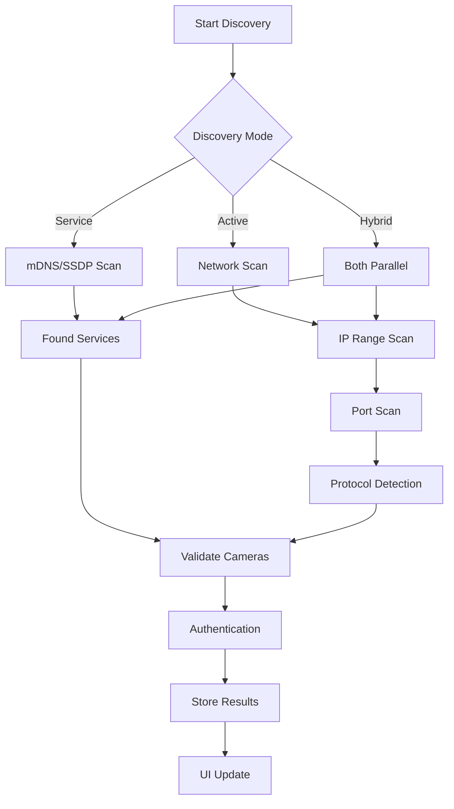

# Camera Discovery Architecture - Comprehensive Improvement Plan

## Executive Summary

After deep analysis of the current camera discovery implementation in the Anava Infrastructure Deployer, I've identified critical gaps and designed a comprehensive improvement plan to make camera discovery truly "ironclad". The current system only supports HTTP on port 80 with single credential sets, missing many real-world scenarios where cameras operate on HTTPS, alternative ports, or behind firewalls that block ICMP.

## Current State Analysis

### Existing Implementation
- **Location**: `/src/main/services/camera/cameraDiscoveryService.ts`
- **UI Component**: `/src/renderer/pages/camera/EnhancedCameraDiscoveryPage.tsx`
- **Configuration Service**: `/src/main/services/camera/cameraConfigurationService.ts`

### Current Capabilities
1. **Network Scanning**: IP range scanning with ICMP ping
2. **Protocol**: HTTP-only on port 80
3. **Authentication**: Single credential set with digest auth
4. **VAPIX Validation**: Basic `/axis-cgi/param.cgi` endpoint check
5. **Platform Support**: Windows and macOS with system command dependencies

### Critical Limitations

#### 1. Protocol & Port Restrictions
- **Single Port**: Only scans port 80
- **HTTP Only**: No HTTPS support
- **No Certificate Handling**: Would fail on cameras with self-signed certificates
- **Missing Common Ports**: 443, 8080, 8000, 8443

#### 2. Discovery Method Limitations
- **ICMP Dependency**: Misses cameras behind firewalls blocking ping
- **No Service Discovery**: Missing mDNS/Bonjour and SSDP/UPnP
- **Sequential Scanning**: Slow on large networks
- **No Retry Logic**: Single failure = camera skipped

#### 3. Authentication Challenges
- **Single Credential Assumption**: All cameras must use same credentials
- **No Credential Management**: Can't handle mixed deployments
- **Binary Auth Status**: No per-camera credential storage

#### 4. UX Issues
- **Limited Feedback**: Basic progress reporting
- **No Manual Override**: Can't add cameras on non-standard configs
- **No Discovery Profiles**: No quick presets for common scenarios

## Proposed Architecture

### Core Design Principles
1. **Protocol Agnostic**: Support HTTP/HTTPS with automatic detection
2. **Multi-Port Scanning**: Intelligent port prioritization
3. **Service Discovery First**: Use native protocols before active scanning
4. **Credential Flexibility**: Per-camera credential management
5. **Robust Error Handling**: Retry logic with exponential backoff
6. **Real-time Feedback**: Granular progress reporting

### Component Architecture

```typescript
// Core discovery orchestrator
class CameraDiscoveryOrchestrator {
  private protocolHandlers: Map<string, ProtocolHandler>
  private serviceDiscovery: ServiceDiscoveryManager
  private credentialManager: CredentialManager
  private discoveryQueue: PQueue
  
  async discover(options: DiscoveryOptions): Promise<Camera[]> {
    // 1. Service discovery (mDNS, SSDP)
    // 2. Active scanning (concurrent with queue)
    // 3. Protocol detection (HTTP/HTTPS)
    // 4. Authentication attempts
    // 5. Validation & deduplication
  }
}
```

### Key Components

#### 1. Protocol Handlers
```typescript
interface ProtocolHandler {
  name: string
  tryConnect(ip: string, port: number): Promise<ConnectionResult>
  validateCamera(connection: Connection): Promise<CameraInfo>
}

class HttpsHandler implements ProtocolHandler {
  constructor(private acceptSelfSigned: boolean = true) {}
  
  async tryConnect(ip: string, port: number) {
    const httpsAgent = new https.Agent({ 
      rejectUnauthorized: !this.acceptSelfSigned 
    })
    // Attempt HTTPS connection with self-signed cert support
  }
}
```

#### 2. Service Discovery Manager
```typescript
class ServiceDiscoveryManager {
  // mDNS/Bonjour for Axis cameras
  async discoverMDNS(): Promise<ServiceDevice[]> {
    // Look for _axis-video._tcp.local
    // Parse TXT records for model/capabilities
  }
  
  // SSDP/UPnP discovery
  async discoverSSDP(): Promise<ServiceDevice[]> {
    // M-SEARCH for axis devices
    // Parse device descriptions
  }
}
```

#### 3. Intelligent Port Scanner
```typescript
const CAMERA_PORTS = {
  priority: [443, 80],      // Try these first
  common: [8080, 8000, 81], // Then these
  extended: [8443, 8081]    // Finally these
}

class PortScanner {
  async scan(ip: string, ports: number[]): Promise<OpenPort[]> {
    // TCP connect scan with timeout
    // Return open ports with service hints
  }
}
```

#### 4. Credential Manager
```typescript
class CredentialManager {
  private credentials: CredentialSet[] = []
  private cameraCredentials: Map<string, string> = new Map()
  
  async tryAuthenticate(camera: Camera): Promise<AuthResult> {
    // Try no-auth first
    // Try each credential set
    // Store successful credentials per camera
    // Support credential import/export
  }
}
```

### Discovery Flow



## Implementation Roadmap

### Phase 1: Foundation (Week 1)
1. **Multi-Protocol Support**
   - Implement HTTPS handler with self-signed cert support
   - Create protocol detection logic
   - Add connection pooling for performance

2. **Port Scanning**
   - Implement TCP connect scanning
   - Add configurable port lists
   - Create priority-based scanning

3. **Credential Management**
   - Build credential storage system
   - Implement per-camera credential tracking
   - Add UI for credential sets

### Phase 2: Service Discovery (Week 2)
1. **mDNS/Bonjour Integration**
   - Add `bonjour-service` package
   - Implement Axis camera discovery
   - Parse service metadata

2. **SSDP/UPnP Support**
   - Add `node-ssdp` package
   - Implement SSDP discovery
   - Handle device descriptions

3. **Discovery Orchestration**
   - Combine service and active discovery
   - Implement deduplication
   - Add discovery profiles

### Phase 3: Reliability (Week 3)
1. **Retry Logic**
   - Exponential backoff for failed operations
   - Configurable retry policies
   - Circuit breaker pattern

2. **Error Handling**
   - Comprehensive error classification
   - Recovery strategies
   - User-friendly error messages

3. **Performance Optimization**
   - Concurrent scanning with p-queue
   - Connection pooling
   - Caching discovered devices

### Phase 4: User Experience (Week 4)
1. **Real-time Feedback**
   - Granular progress events
   - Discovery timeline view
   - Per-camera status tracking

2. **Manual Override**
   - Add camera manually with full config
   - Import/export camera lists
   - Quick connect for known cameras

3. **Discovery Profiles**
   - Common network configurations
   - Quick scan vs deep scan
   - Custom port/protocol presets

## Technical Decisions

### Dependencies
- **bonjour-service**: Cross-platform mDNS/Bonjour
- **node-ssdp**: SSDP/UPnP client
- **p-queue**: Concurrency control
- **https**: Native Node.js module for HTTPS
- **net**: Native module for TCP scanning

### Platform Considerations
- **Windows**: Use native Windows APIs where possible
- **macOS**: Leverage Bonjour natively
- **Linux**: Support via Avahi (future)

### Security
- **Discovery Only**: Accept self-signed certs only during discovery
- **Credential Storage**: Use Electron's safeStorage API
- **Network Behavior**: Implement rate limiting
- **User Consent**: Always inform before scanning

## Edge Cases & Solutions

### 1. Cameras Behind NAT
- **Solution**: Manual entry with full configuration
- **Future**: STUN/TURN for NAT traversal

### 2. Non-Standard Ports
- **Solution**: Configurable port lists
- **UI**: Easy port range specification

### 3. Mixed HTTP/HTTPS Deployments
- **Solution**: Protocol detection per camera
- **Fallback**: Try both protocols

### 4. Large Networks (1000+ IPs)
- **Solution**: Chunked scanning with progress
- **Optimization**: Service discovery first

### 5. Cameras Requiring VPN
- **Solution**: Detect VPN interfaces
- **UI**: Network interface selection

## Success Metrics

1. **Discovery Rate**: >95% of online cameras found
2. **Speed**: <30 seconds for /24 network
3. **Reliability**: <1% false negatives
4. **UX**: <3 clicks to discover and configure

## Migration Strategy

1. **Backward Compatibility**: Keep existing methods
2. **Feature Flags**: Roll out incrementally
3. **Beta Testing**: Test on diverse networks
4. **Documentation**: Comprehensive guides

## Future Enhancements

1. **ONVIF Support**: Industry standard protocol
2. **Cloud Discovery**: Via manufacturer APIs
3. **AI-Powered**: Predict camera locations
4. **Mobile Bridge**: Discover via mobile app